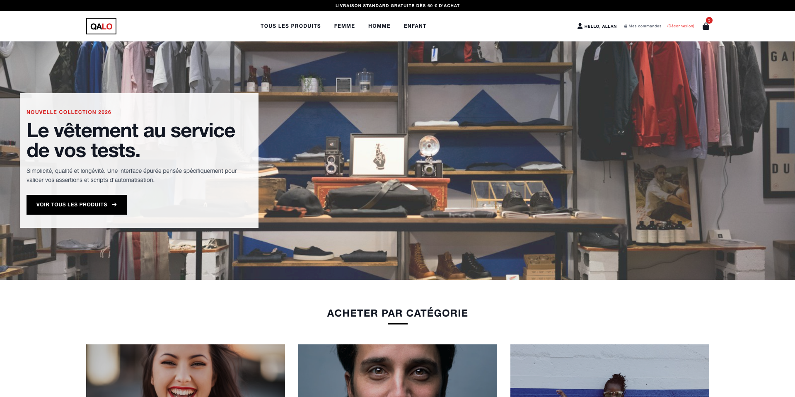

# 🚀 Uniqlo Clone - E-commerce QA & Automation Ready


[](https://opensource.org/licenses/MIT)




## 📝 Vue d'ensemble

Ce projet est une application e-commerce "Vanilla JS" conçue pour servir de bac à sable aux tests automatisés et manuels. L'objectif est de démontrer une architecture propre, une gestion d'état centralisée via `localStorage` et une interface utilisateur réactive.  
Pour plus de visuels, consultez le dossier "screenshots".

## 💡 Pourquoi ce projet existe ?

La fiabilité de l'automatisation commence par la stabilité de l'environnement de test. En travaillant sur des suites de tests automatisés (E2E et performance), j'ai été confronté à l'instabilité récurrente des sites de démo publics, qui provoquaient fréquemment des "faux négatifs" au sein de mes pipelines CI/CD.

J'ai donc conçu Uniqlo Clone Store pour répondre aux besoins suivants :

- Contrôle Total de l'Environnement : En hébergeant moi-même cette application sur Netlify, je maîtrise l'infrastructure. Il n'y a plus de dépendance vis-à-vis d'un serveur tiers capricieux.

- Tests Déterministes : Chaque interaction utilisateur est prévisible. Cela me permet de garantir que si un test échoue, le bug vient réellement de mon code ou de ma suite de tests.

- Bac à sable pour la performance : Ce projet sert de laboratoire pour expérimenter des stratégies de Load Testing (k6) et mesurer précisément l'impact des optimisations.

- Immersion QA : Ce projet est structuré pour permettre une montée en compétence sur l'automatisation moderne (Playwright, k6, GitHub Actions) sur une base de code propre et évolutive.

## 🛠 Architecture Technique

- **Stack :** HTML5, Tailwind CSS, Vanilla JavaScript (ES6+).
- **Gestion d'état :** Moteur de persistance via `localStorage` avec listener d'événements (`cartUpdated`).
- **Qualité de code :** Séparation des responsabilités (`scripts/global.js` pour le moteur, pages spécifiques pour les vues).
- **Performance :** Optimisation du rendu DOM et gestion asynchrone des flux de commande.

## 🧪 Stratégie de Test (QA Perspective)

En tant qu'application orientée QA, ce projet supporte plusieurs couches de tests :

### 1. Tests Fonctionnels (Manual/Exploratory)

- **User Journeys :** Vérification du flux _Browse -> Add to Cart -> Checkout -> History_.
- **Edge Cases :** Test des paniers vides, coupons expirés/invalides, et persistance lors du rechargement de page.

### 2. Tests de Performance (Load/Stress)

Le projet est prêt pour des tests de montée en charge via **k6**.

- _Objectif :_ Mesurer la latence entre le clic client et la mise à jour de l'historique de commande.
- _Commande de lancement :_ `k6 run tests/performance/load-test.js`

### 3. Automatisation à venir

- **E2E (End-to-End) :** Intégration prévue avec **Playwright** ou **Cypress** pour automatiser les tests de non-régression sur le tunnel d'achat.

## 🚀 Installation & Démarrage

1. **Cloner le dépôt :**

```bash
git clone https://github.com/votre-user/uniqlo-clone-store.git
cd uniqlo-clone-store

```

2. **Lancer le serveur local :**
   Utilisez n'importe quel serveur statique (ex: `live-server` ou `python -m http.server`).
3. **Simuler une API (Optionnel) :**
   Pour passer d'un mode `localStorage` à une vraie API REST, utilisez `json-server` :

```bash
npx json-server --watch db.json

```

## ⚖️ Licence

Ce projet est distribué sous la licence **MIT**. Vous êtes libre d'utiliser, copier, modifier et distribuer ce code pour n'importe quel usage, y compris commercial, sous réserve de conserver la notice de copyright originale.
